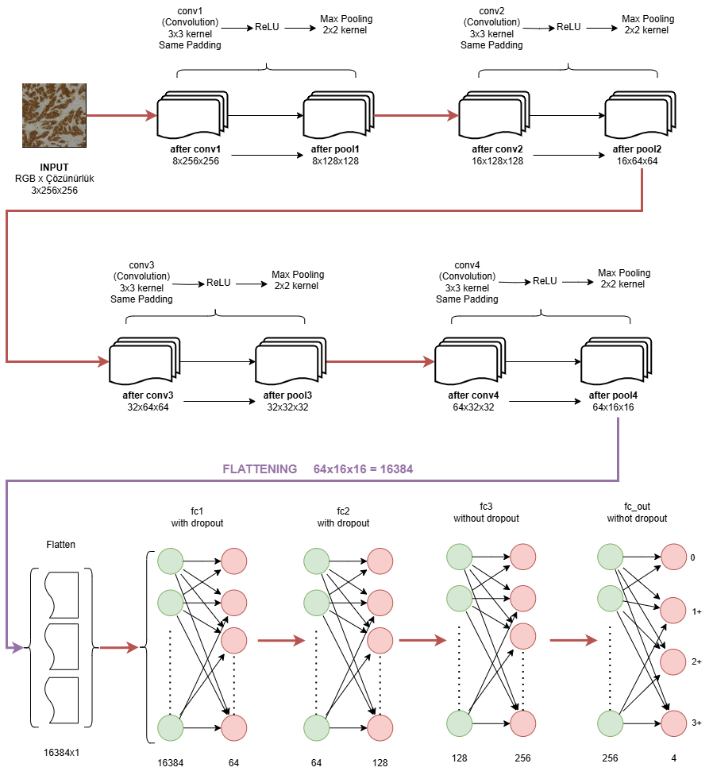
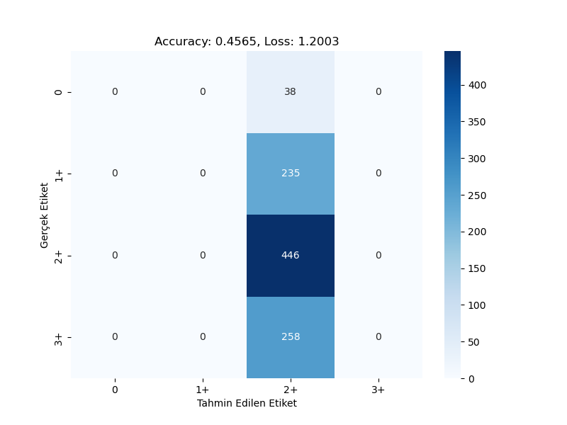
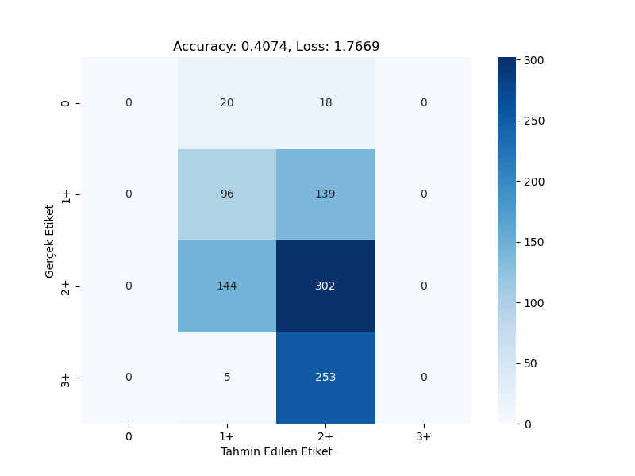
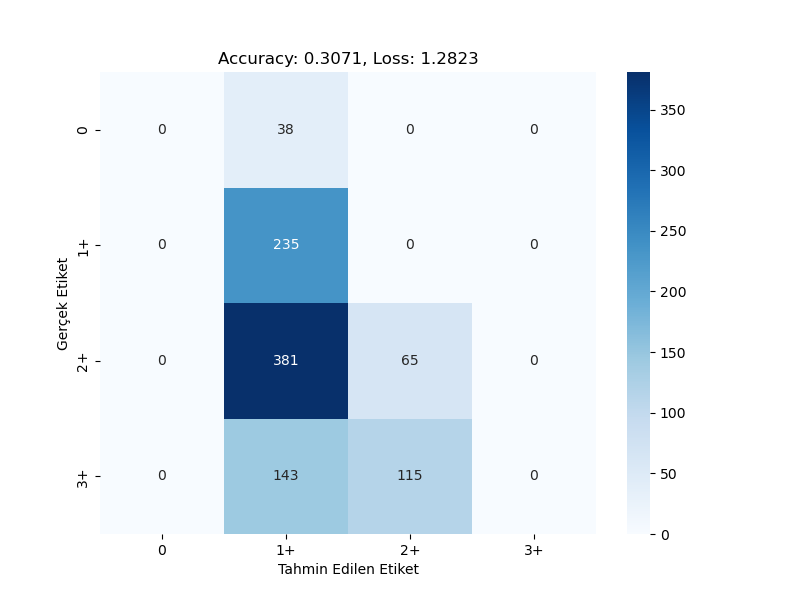
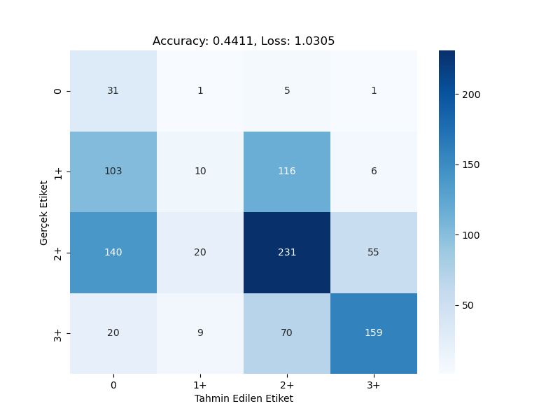

# CNN-Based HER2 Score Classification

This repository contains a deep learning project that classifies HER2 scores from breast cancer histopathology images using Convolutional Neural Networks (CNN).

### CNN Model Architecture

## 📁 Dataset
- Source: Breast Cancer Immunohistochemical (BCI) dataset
- Image Size: 1024x1024
- Classes: `0`, `1+`, `2+`, `3+` (HER2 Scores)

## 🎯 Objective
To explore different CNN-based approaches to classify HER2 scores accurately and efficiently. Four models were developed and evaluated.

## 🧪 Model Approaches & Results

### Model 1: Basic CNN
- Input Size: 1024x1024
- Conv Layers: 4 (8-16-32-64 channels)
- Fully Connected: 64-128-256
- Accuracy: **0.4565**, Loss: **1.2003**
- Model 1: 
- 🔍 Only predicted `2+` class correctly

### Model 2: Class Weighted CNN
- Same architecture as Model 1
- Weighted loss to address class imbalance
- Accuracy: **0.4074**, Loss: **1.7669**
- Model 2: 
- 🔍 Better on `1+`, but overall weaker generalization

### Model 3: Weighted + Augmented CNN
- Data augmentation (flip, rotation, color jitter) added
- Accuracy: **0.3071**, Loss: **1.2823**
- Model 3: 
- 🔍 Confused mostly between `1+` and `2+`

### Model 4: Optimized CNN (Best)
- Input Size: 256x256, Dropout: 0.3
- Batch Size: 256, LR: 0.0001
- Learning Rate Scheduler + Early Stopping
- Accuracy: **0.4411**, Loss: **1.0305**
- Model 4: 
- 🔍 Balanced predictions across all classes

## 🔧 Hyperparameter Comparison

| Model | Input | Batch | Dropout | LR     | Epoch | Accuracy | Loss   |
|-------|-------|--------|---------|--------|--------|----------|--------|
| 1     | 1024  | 32     | 0.5     | 0.001  | 100    | 0.4565   | 1.2003 |
| 2     | 1024  | 32     | 0.5     | 0.001  | 100    | 0.4074   | 1.7669 |
| 3     | 1024  | 32     | 0.5     | 0.001  | 40     | 0.3071   | 1.2823 |
| 4     | 256   | 256    | 0.3     | 0.0001 | 60     | 0.4411   | 1.0305 |

## 📌 Notes
- TensorBoard logs include loss, accuracy, and learning rate tracking.
- Early stopping was used to prevent overfitting.

---
**Prepared by:** Mehmet Sefa KARATAŞ
**Course:** BLM22438 - Introduction to Deep Learning